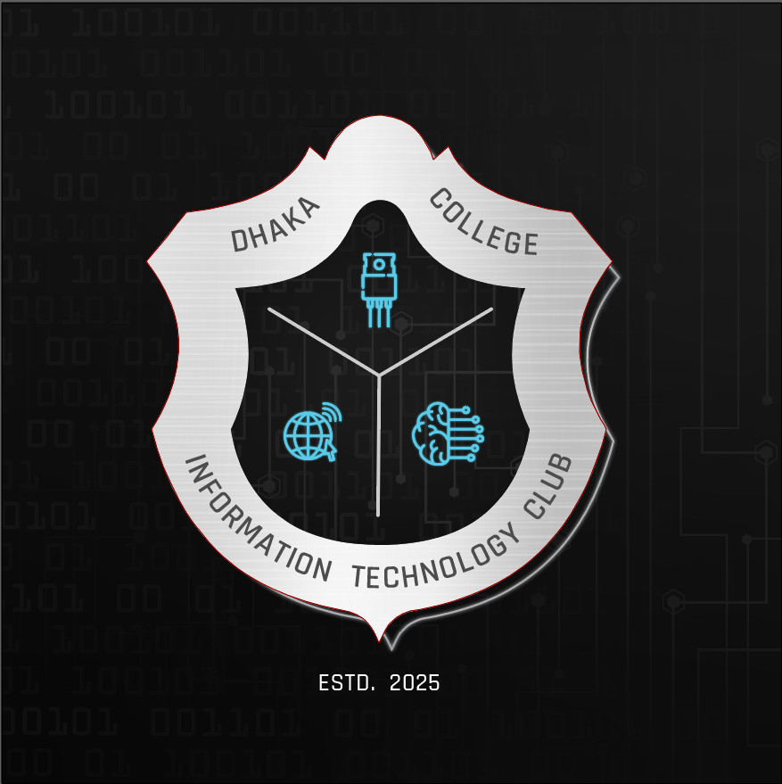

# DCITC Website - Dhaka College IT Club

A modern, animated, and responsive website for the Dhaka College IT Club (DCITC) built with React 19, Vite, and cutting-edge web technologies. The site features glassmorphism design, smooth animations, and a dark-themed aesthetic.



## 🚀 Tech Stack

| Technology | Purpose |
|------------|---------|
| **React 19** | Frontend framework with latest features |
| **Vite 6** | Fast build tool with HMR |
| **React Router DOM 7** | Client-side routing |
| **Framer Motion 12** | Animation library for smooth transitions |
| **GSAP** | Advanced scroll-triggered animations |
| **React Parallax Tilt** | 3D tilt effects on cards |
| **Luxon** | Date/time manipulation for calendar |
| **Font Awesome** | Icon library |
| **Three.js / React Three Fiber** | 3D graphics (if used) |
| **Sonner** | Toast notifications |

---

## 📁 Project Structure

```
dcitc-website/
├── public/                     # Static assets served directly
├── src/
│   ├── assets/                 # Static assets (fonts, images)
│   │   ├── fonts/              # Custom fonts
│   │   └── images/             # All images organized by type
│   │       ├── events/         # Event-related images
│   │       ├── gallery/        # Gallery photos (143 images)
│   │       ├── logo/           # Club logos
│   │       ├── projects/       # Project screenshots
│   │       ├── slider/         # Slider images
│   │       └── team/           # Executive member photos
│   │           ├── 2025/       # 2025 session executives
│   │           ├── 2026/       # 2026 session executives
│   │           └── faculty/    # Faculty supervisors
│   ├── components/             # Reusable React components
│   │   ├── common/             # Shared UI components
│   │   ├── layout/             # Layout components
│   │   └── sections/           # Page section components
│   ├── context/                # React context providers
│   ├── data/                   # Static data files
│   ├── hooks/                  # Custom React hooks
│   ├── pages/                  # Page components
│   ├── styles/                 # Global styles
│   └── utils/                  # Utility functions
├── index.html                  # HTML entry point
├── vite.config.js              # Vite configuration
├── eslint.config.js            # ESLint configuration
└── package.json                # Dependencies and scripts
```

---

## 📄 File Documentation

### Root Configuration Files

| File | Description |
|------|-------------|
| `index.html` | Main HTML template with meta tags, favicon, and Font Awesome CDN link. Entry point that loads `main.jsx`. |
| `package.json` | Project dependencies, scripts (`dev`, `build`, `lint`, `preview`), and metadata. Uses ES modules. |
| `vite.config.js` | Vite configuration with React plugin, path alias (`@` → `src/`), dev server on port 3000, and build output settings. |
| `eslint.config.js` | ESLint flat config with React hooks and refresh plugins, ES2020 target, and browser globals. |

---

### Entry Files (`src/`)

| File | Description |
|------|-------------|
| `main.jsx` | React application entry point. Renders `App` in StrictMode, imports global CSS. |
| `App.jsx` | Root component with React Router setup. Defines all routes wrapped in `Layout` component. |
| `App.css` | App-level styles (if any additional styles not in global). |
| `index.css` | Additional global CSS imports or overrides. |

---

### Pages (`src/pages/`)

| File | Description |
|------|-------------|
| `Home.jsx` | Main landing page assembling: HeroSection, AboutSnippet, FeaturedProjects, UpcomingEvents, CoreTeamHighlight, and ContactCTA. Uses GSAP ScrollTrigger for parallax hero fade effects. |
| `Home.css` | Styles for homepage sections including section backgrounds and spacing. |
| `About.jsx` | Club information page featuring: 3D tilt logo, Vision/Mission/What We Do cards, interactive Timeline, ImpactStats with count-up animations, and FAQAccordion. |
| `About.css` | Styles for about page hero, cards grid, and section layouts. |
| `Events.jsx` | Events listing page with: FeaturedEvent with countdown timer, search/filter controls, switchable Grid/Calendar views, and EventModal for details. Uses animated filtering. |
| `Events.css` | Styles for events page including grid layout, controls, and responsive breakpoints. |
| `Executives.jsx` | Executive team showcase with: session tabs (Faculty, 2026, 2025), department filtering, ExecutiveCard grid, and ExecutiveModal for full profiles. Body scroll lock when modal open. |
| `Executives.css` | Styles for executive tabs, filter buttons, card grid, and animations. |
| `Projects.jsx` | Project portfolio page with: category filtering, search functionality, animated ProjectCard grid with AnimatePresence, tech stack tags, and GitHub/demo links. |
| `Projects.css` | Styles for project cards, filter bar, search input, and responsive grid. |
| `Gallery.jsx` | Photo gallery page with: masonry-style grid (143 images), featured image badges, and full-screen Lightbox with slideshow, keyboard navigation, and fullscreen support. |
| `Gallery.css` | Styles for masonry grid, image hover effects, and featured item sizing. |
| `Departments.jsx` | Departments showcase page with: filter bar, DepartmentCardFull components displaying stats with count-up animations, tech stacks, and department descriptions. |
| `Departments.css` | Styles for department cards, stats display, and filter buttons. |
| `NotFound.jsx` | 404 error page with simple "Page not found" message and link back to home. |

---

### Layout Components (`src/components/layout/`)

| File | Description |
|------|-------------|
| `Layout.jsx` | Main layout wrapper using React Router's `Outlet`. Includes Navbar at top and Footer at bottom. Adds 80px padding-top for fixed navbar. |
| `Navbar.jsx` | Fixed navigation bar with: scroll-responsive glassmorphism effect, animated logo, desktop nav links, mobile hamburger menu with slide-in animation, body scroll lock when mobile menu open. Route-aware active states. |
| `Footer.jsx` | Site footer with: logo and tagline, Quick Links and Resources columns with animated hover effects, social media links with glow animations, scroll-to-top button, and copyright. |

---

### Common Components (`src/components/common/`)

| File | Description |
|------|-------------|
| `index.js` | Barrel export file for all common components. |
| `Button.jsx` | Reusable button with `primary`/`outline` variants, Framer Motion hover/tap animations, optional icon support, and disabled state handling. |
| `GlassCard.jsx` | Glassmorphism card wrapper with: blur backdrop, subtle border, staggered reveal animations, and hover lift effect. Accepts custom styles and delay. |
| `SectionHeader.jsx` | Reusable section header with: animated gradient title, subtitle text, and animated divider line. Supports center/left alignment. |
| `EventCard.jsx` | Event display card with: image section with status/category/price badges, event details (date, location, description), tags (virtual/in-person/featured), and "View Details" button. |
| `EventCard.css` | Styles for event card layout, badges, responsive behavior, and hover states. |
| `EventModal.jsx` | Full event detail modal with: backdrop click-to-close, escape key support, large header image, event metadata, description, and "Register Now" CTA. Body scroll lock enabled. |
| `EventModal.css` | Styles for modal overlay, content container, animations, and responsive sizing. |
| `ExecutiveCard.jsx` | Executive member card with: profile image with hover overlay, name, position, department, and click-to-open modal interaction. |
| `ExecutiveCard.css` | Styles for executive card image, info layout, and hover effects. |
| `ExecutiveModal.jsx` | Detailed executive profile modal with: large photo with glow effect, name/position/department, skills tags, bio text, and social media links with platform-specific icons. |
| `ExecutiveModal.css` | Styles for modal layout (image left, details right), skills badges, and social icons. |

---

### Section Components (`src/components/sections/`)

#### Homepage Sections

| File | Description |
|------|-------------|
| `HeroSection.jsx` | Full-viewport hero with: floating code symbols (`</>`, `{}`, `#`, `01`), 3D tilt DCITC logo, animated typewriter motto ("Building Tomorrow/Today" cycle), and CTA buttons. |
| `HeroSection.css` | Styles for hero layout, floating symbols animation, gradient text, and responsive sizing. |
| `AboutSnippet.jsx` | Homepage about preview with: 3D tilt logo in glowing container, circuit board decorations, "About DCITC" text with tagline, quick stats row, and "Explore More" CTA. |
| `AboutSnippet.css` | Styles for two-column layout, circuit decorations, stats display, and glass effect wrapper. |
| `FeaturedProjects.jsx` | Top 4 featured projects showcase with: project image with GitHub/demo overlay links, category badge, tech stack tags, stats (branches/contributors), and "View All Projects" CTA. |
| `FeaturedProjects.css` | Styles for project cards grid, image overlay, tech tags, and stats display. |
| `UpcomingEvents.jsx` | Next 3 upcoming events with: event image with date overlay, category badge, event details, location with virtual/in-person icon, price badge, and "Register Now" button. |
| `UpcomingEvents.css` | Styles for events cards, meta information, and category colors. |
| `CoreTeamHighlight.jsx` | Executive board preview (top 4 from 2026) with: large profile image, name with verified badge, position, bio excerpt, "View Profile" button, and social links on hover. Opens modal on click. |
| `CoreTeamHighlight.css` | Styles for team cards grid, image sizing, verified badge, and social hover links. |
| `ContactCTA.jsx` | Final call-to-action section with: decorative glow orbs and grid overlay, "Join Our Community" badge, headline, description, animated "Join DCITC Now" button with membership fee note. |
| `ContactCTA.css` | Styles for CTA background effects, button glow animation, and responsive layout. |
| `DepartmentOverview.jsx` | Homepage department overview grid with: department icon in glowing container, name, tagline, and hover glow effect. Uses icon mapping from Font Awesome classes. |
| `DepartmentOverview.css` | Styles for department cards grid, icon styling, and glow effects. |

#### About Page Sections (`src/components/sections/about/`)

| File | Description |
|------|-------------|
| `index.js` | Barrel export for about section components. |
| `Timeline.jsx` | Interactive journey timeline with: vertical sidebar navigation with year/date markers, auto-play through events (5s interval), animated content transitions, event icon and decorations, and navigation arrows. |
| `Timeline.css` | Styles for timeline sidebar, markers, content area, and auto-scroll behavior. |
| `ImpactStats.jsx` | Animated statistics grid with: count-up animation triggered on scroll into view, stat icon, value with optional suffix, and label. Uses `useInView` hook for visibility detection. |
| `ImpactStats.css` | Styles for stats grid, individual stat cards, and number animation. |
| `FAQAccordion.jsx` | Expandable FAQ section with: only one item open at a time, smooth height animation, chevron rotation indicator, question icon, and staggered reveal animations. |
| `FAQAccordion.css` | Styles for accordion items, question/answer sections, and active states. |

#### Events Page Sections (`src/components/sections/events/`)

| File | Description |
|------|-------------|
| `index.js` | Barrel export for events section components. |
| `FeaturedEvent.jsx` | Highlighted event with: large image with featured badge, event metadata (date, location, price), countdown timer (days/hours/minutes/seconds) using `useCountdown` hook, and prominent styling. |
| `FeaturedEvent.css` | Styles for featured event card, countdown boxes, and responsive layout. |
| `EventControls.jsx` | Filter/search controls with: search input with clear button, category filter buttons, and grid/calendar view toggle buttons. |
| `EventControls.css` | Styles for controls bar, search input, filter buttons, and view toggle. |
| `EventGrid.jsx` | Grid view container with: staggered animation variants, empty state with icon and suggestions, results count header, and EventCard rendering with click handlers. |
| `EventGrid.css` | Styles for grid layout, empty state, and results header. |
| `EventCalendar.jsx` | Monthly calendar view using Luxon for date handling. Features: month navigation, "Today" button, weekday headers, day cells with event indicators, event dots colored by category, and multi-day event support. |
| `EventCalendar.css` | Styles for calendar grid, day cells, event indicators, and navigation. |

#### Gallery Page Sections (`src/components/sections/gallery/`)

| File | Description |
|------|-------------|
| `index.js` | Barrel export for gallery components. |
| `Lightbox.jsx` | Full-screen image viewer with: keyboard navigation (arrow keys, escape), slideshow auto-play (3s), thumbnail strip with auto-scroll, fullscreen toggle, image preloading for adjacent images, and play/pause controls. |
| `Lightbox.css` | Styles for lightbox overlay, image display, controls bar, thumbnails strip, and fullscreen mode. |

#### Departments Page Sections (`src/components/sections/departments/`)

| File | Description |
|------|-------------|
| `DepartmentCardFull.jsx` | Detailed department card with: featured badge (if applicable), department icon with color theming, name and tagline, description text, animated stats with count-up (projects/members/awards), and tech stack tags. |
| `DepartmentCardFull.css` | Styles for full department card, stats row, tech stack display, and color theming. |

#### Projects Page Sections (`src/components/sections/projects/`)

| File | Description |
|------|-------------|
| `ProjectCard.jsx` | Project display card with: project image with featured badge, title, tech stack tags (max 3 shown + "more" indicator), description, stats (branches/contributors), and action buttons (GitHub, Demo). |
| `ProjectCard.css` | Styles for project card layout, tech tags, stats display, and action buttons. |

---

### Custom Hooks (`src/hooks/`)

| File | Description |
|------|-------------|
| `useCountdown.js` | Custom hook returning `{ days, hours, minutes, seconds, isExpired }` for countdown timer functionality. Handles ISO date strings and updates every second. Used in FeaturedEvent. |
| `useScrollPosition.js` | (Empty) Placeholder for scroll position tracking hook. |

---

### Data Files (`src/data/`)

| File | Description |
|------|-------------|
| `about.js` | About page content: `aboutCards` (Vision, Mission, What We Do), `timelineData` (7 milestone events 2018-2025), `journeyStats`, `impactStats`, `testimonials`, and `faqs` array. |
| `departments.js` | Department data: `departments` array with id, name, icon, tagline, description, stats, techStack, color, and isFeatured flag. Includes `departmentFilters` for filtering UI. |
| `events.js` | Events data: `eventCategories` for filtering, `eventTags` for badges, and `eventsData` array with full event objects including dates, locations, status, pricing, and featured flags. |
| `executives.js` | Executive team data: `executiveSessions` object keyed by "Faculty", "2026", "2025" containing member objects with name, position, department, image path, bio, skills, and socials. Includes `executiveDepartments` and `sessionLabels`. |
| `gallery.js` | Gallery data: generates 143 image objects with `generateGalleryData()`, tracks `featuredImageIds`, assigns categories by index range. Images located in `/gallery/` directory. |
| `projects.js` | Project portfolio: `projectCategories` for filtering, `projects` array with title, description, techStack, stats, image, links (github/liveDemo), and isFeatured flag. |
| `siteMeta.js` | Global site metadata: `contactInfo`, `socialLinks` array, `clubHistory` timeline, `globalStats`, `heroStats` for homepage, `quickLinks`, `resourceLinks`, and `clubInfo`. |
| `techTuesday.js` | Tech Tuesday slider content: weekly educational posts with badge, title, description, stats, and theme colors. Topics include Dead Internet Theory, AI Chips, Roko's Basilisk, etc. |

---

### Styles (`src/styles/`)

| File | Description |
|------|-------------|
| `global.css` | Complete design system including: CSS variables (colors, typography, spacing, shadows, z-index, glassmorphism), CSS reset, Google Fonts import (Inter, Montserrat), and base element styles. |
| `variables.css` | (Empty) Placeholder for additional CSS custom properties. |

---

### Utilities (`src/utils/`)

| File | Description |
|------|-------------|
| `helpers.js` | (Empty) Placeholder for utility functions like formatters, validators, etc. |

---

### Assets (`src/assets/`)

| Directory | Description |
|-----------|-------------|
| `fonts/` | Custom font files (if any beyond Google Fonts). |
| `images/events/` | Event banner and promotional images. |
| `images/gallery/` | 143 gallery photos named `FB 001.jpg` through `FB 143.jpg` (with FB 131.webp). |
| `images/logo/` | DCITC logo variations including `dcitc-logo.png` and `dcitc-logo-trans.png` (transparent). |
| `images/projects/` | Project screenshots and thumbnails. |
| `images/slider/` | Slider/carousel images. |
| `images/team/2025/` | 2025 session executive photos (president.jpg, vice_president.jpg, etc.). |
| `images/team/2026/` | 2026 session executive photos following the same naming convention. |
| `images/team/faculty/` | Faculty supervisor photos. |

---

## 🛠️ Available Scripts

```bash
# Start development server (port 3000)
npm run dev

# Build for production
npm run build

# Preview production build
npm run preview

# Run ESLint
npm run lint
```

---

## 🎨 Design Features

- **Dark Theme**: Deep backgrounds (#0c0c14) with cyan (#00b4db) accent colors
- **Glassmorphism**: Frosted glass effect cards with blur backdrop
- **Animations**: Framer Motion for component transitions, GSAP for scroll effects
- **3D Effects**: React Parallax Tilt for interactive card tilting
- **Responsive**: Mobile-first design with breakpoints for all screen sizes
- **Typography**: Montserrat for headings, Inter for body text
- **Icons**: Font Awesome integration throughout

---

## 📱 Pages Overview

1. **Home** (`/`) - Landing page with hero, about snippet, featured projects, events, team highlight, and CTA
2. **About** (`/about`) - Club history, mission, timeline, stats, and FAQ
3. **Executives** (`/executives`) - Team members by session with filtering
4. **Events** (`/events`) - Event listings with search, filter, and calendar views
5. **Projects** (`/projects`) - Project portfolio with category filtering
6. **Gallery** (`/gallery`) - Photo gallery with lightbox viewer
7. **Departments** (`/departments`) - Club departments with stats and tech stacks
8. **404** (`/*`) - Not found page

---

## 🤝 Contributing

1. Fork the repository
2. Create a feature branch (`git checkout -b feature/new-feature`)
3. Commit changes (`git commit -m 'Add new feature'`)
4. Push to branch (`git push origin feature/new-feature`)
5. Open a Pull Request

---

## 📄 License

This project is maintained by DCITC - Dhaka College IT Club.

---

## 📞 Contact

- **Email**: info@dcitc.com
- **Website**: [dcitc.com](https://dcitc.com)
- **Facebook**: [facebook.com/dcitc](https://facebook.com/dcitc)
- **GitHub**: [github.com/dcitc](https://github.com/dcitc)
